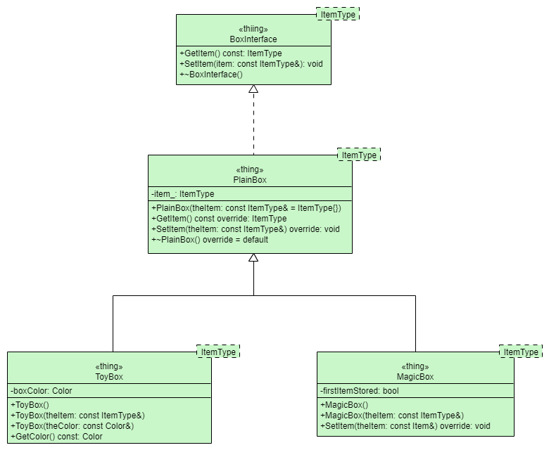
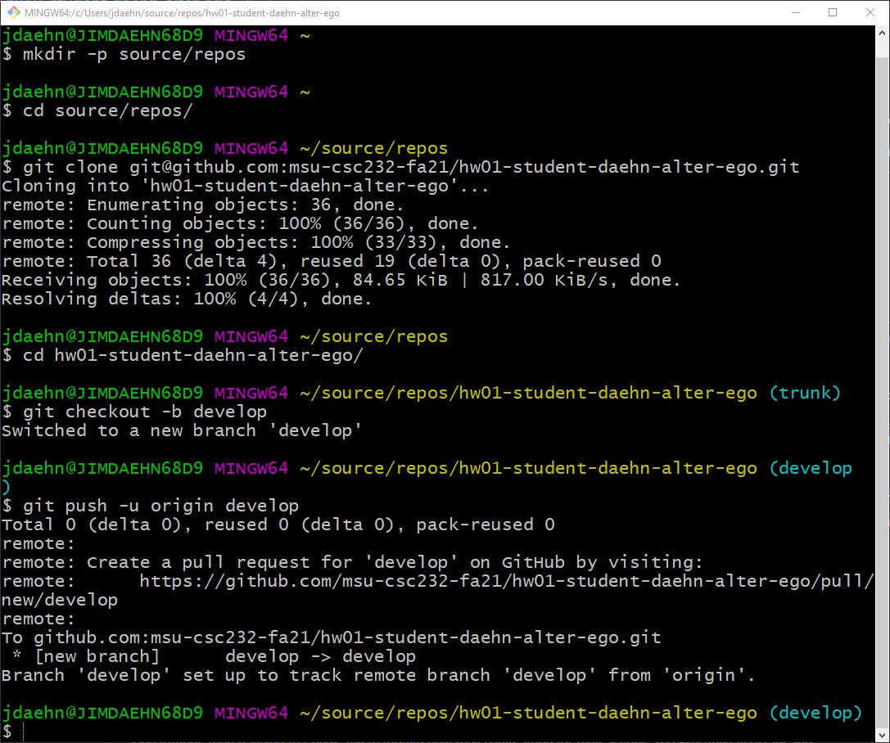

# HW01 - Slay the Nemean Lion

Driven mad by CSC131, the Student smashed their laptop.

After recovering their sanity, the Student deeply regretted their actions; they were purified by Chair of the CS Department, then traveled to Cheek 209 to inquire how they could atone for their actions. The Executive Assistant and Oracle of Delphi, advised them to go to Cheek 61M and serve its occupant, Jim Daehn, for one semester, performing whatever labors Jim might set upon them; in return, they would be rewarded with immortality, or at least forward movement in their curriculum.

The Student despaired at this, loathing to serve a man whom they knew to be far inferior to themselves, yet fearing to oppose the Chair. Eventually, they placed themselves at Jim's disposal.

Jim originally ordered the Student to perform ten labors. The Student accomplished these tasks, but Jim refused to recognize two: the slaying of the [Lernaean Hydra](https://en.wikipedia.org/wiki/Labours_of_Hercules#Second:_Lernaean_Hydra), as the Students' GA had helped them; and the cleansing of the [Augeas](https://en.wikipedia.org/wiki/Labours_of_Hercules#Fifth:_Augean_stables), because the Student accepted payment for the labor.

Jim set two more tasks (fetching the [Golden Apples of Hesperides](https://en.wikipedia.org/wiki/Labours_of_Hercules#Eleventh:_Golden_Apples_of_the_Hesperides) and capturing [Cerberus](https://en.wikipedia.org/wiki/Labours_of_Hercules#Twelfth:_Cerberus)), which the Student also performed, bringing the total number of tasks to twelve.

It's time to set this story in motion. The Student's first task then, is to [Slay the Nemean Lion](https://en.wikipedia.org/wiki/Labours_of_Hercules#First:_Nemean_lion)...

<a title="sailko, Public domain, via Wikimedia Commons" href="https://commons.wikimedia.org/wiki/File:Pieter_paul_rubens,_ercole_e_i_leone_nemeo,_02.JPG"></a>

## Virtual Methods and Abstract Classes

_Note: This assignment is related to the content of C++ Interlude 1 found in **Data Abstraction and Problem-Solving with C++**, seventh edition, by Carrano & Henry. See [our disclaimer below](#disclaimer--fair-use-statement)._

This assignment is primarily meant to give the student experience in refactoring code, running targets created from `cmake` on the command line, in addition to learning how to submit assignments via GitHub.

## Objectives

In this assignment you

* create an abstract class to serve as an interface
* modify existing code (refactor)

Upon successful completion of this assignment, the student will realize the following design:



## Background Reading

Before you tackle this assignment, it is advised that you read and understand the following in Carrano & Henry:

* **Appendix A** Review of C++ Fundamentals
* **Appendix B** Important Themes in Programming
* **Appendix C** The Unified Modeling Language
* **Chapter 1** Data Abstraction: The Walls
* **C++ Interlude 1** C++ Classes

If you have not read these chapters, do it now!

## C++ Concepts Overview

There are several C++ concepts that are covered in this assignment. While most of the code is written for you, nonetheless, the additional coding needed to complete this assignment will enforce the comprehension of these concepts. These concepts include:

* C++ classes
  * Separation of specification from implementation (header versus source files)
  * Encapsulation
    * Attributes and operations
    * `public` versus `private` access
    * Accessor versus mutator methods
* C++ Interfaces (Abstract classes)
    * Pure virtual methods
* Implementing C++ Interfaces
  * Inheritance as a means of implementing an interface
* Documentation

### C++ Classes

The general form of a class declaration is:

```c++
class SomeClassName
{
public:
    // data members and function members declared here
    // are "visible" or "exposed" to any client
private:
    // data members and function members declared here
    // are "visible" or "exposed" only within this class.
    // They are said to be "encapsulated."
};
```

Don't forget the trailing `;` -- doing so will cause a compiler error and is a very common mistake!

#### Encapsulation

The member functions _could be_ defined within this declaration, but we usually separate the declarations from the definitions by placing the declarations in a **header file** (the so-called, "dot h file:" `.h`) and the definitions in a **source file** (the so-called, "dot cpp file:" `.cpp`). For example, suppose we wish to develop an abstraction of a car. One could declare the class as follows in a header (specification) file named `car.h`:

```c++
#include <iostream> // needed for std::cout and std::endl
#include <string>   // needed for std::string
enum Gear
{
    P, R, N, D
};
enum Direction
{
    Left, Right
};
class Car
{
public:
    Car ( std::string make, std::string model );
    void Start ( );
    void Stop ( );
    void TurnOff ( );
    void ChangeGear ( Gear gear );
    void Drive ( );
    void Brake ( );
    void turn ( Direction direction );
    std::string GetMake ( ) const;
    std::string GetModel ( ) const;
    Gear GetCurrentGear ( ) const;
    void SetCurrentGear ( Gear gear );
private:
    std::string make_;
    std::string model_;
    Gear current_gear_;
};
```

Notice that all member functions are merely _declared_; they haven't been defined yet. The definitions could be placed in another (source/implementation) file named `car.cpp`:

```c++

#include "car.h"

Car::Car ( std::string make, std::string model ) : make_ { std::move( make ) }, model_ { std::move( model ) }, current_gear_ { P }
{
    // Intentionally empty; state initialized via initializer list
}

void Car::Start ( )
{
    std::cout << "Engine starting..." << std::endl;
}

void Car::stop ( )
{
    std::cout << "Car is stopped..." << std::endl;
}

void Car::TurnOff ( )
{
    std::cout << "Engine is off..." << std::endl;
}

void Car::ChangeGear ( Gear gear )
{
    SetCurrentGear( gear );
}

void Car::Drive ( )
{
    Gear gear = GetCurrentGear( );
    if ( gear != P && gear != N )
    {
        std::cout << "Car is currently driving..." << std::endl;
    }
}

void Car::Brake ( )
{
    std::cout << "Car is braking..." << std::endl;
}

void Car::turn ( Direction direction )
{
    std::cout << "Turning ";
    switch ( direction )
    {
    case Left:
        std::cout << "left";
        break;
    case Right:
        std::cout << "right";
    }
    std::cout << "..." << std::endl;
}

std::string Car::GetMake ( ) const
{
    return make_;
}

std::string Car::GetModel ( ) const
{
    return model_;
}

Gear Car::GetCurrentGear ( ) const
{
    return current_gear_;
}

void Car::SetCurrentGear ( Gear gear )
{
    current_gear_ = gear;
}
```

Notice that these are all _member function_ definitions. That is, these are function definitions that are _members_ of some class (namely, the `Car` class). This is seen by the presence of the **scope resolution operator** `::`. So, with each function identifier proceeded by `Car::`, we explicitly see that the function is a member of the class `Car`. In general, class member function definitions will appear (syntactically) as

```c++
return_type ClassName::member_function_name( optional_parameter_list )
{
    // definition
}
```

where `return_type` is the data type of the value returned if the member function is a value-returning member function, or `void` if it does not compute a value. The one exception to this is the definition of the class constructor which does not have a return type (and doesn't use `void`). Also, member functions need not contain a parameter list. In this case, an empty pair of parentheses is still required.

For a demonstration of using this `Car` class, see [demo.cpp](src/demo.cpp) and run the `hw01-demo` target.

#### Class Templates

Often when working on an abstract data type (ADT), we find that the operations may be implemented in a manner that is independent of the underlying data type of the data it processes. In such cases, rather than writing separate "flavors" of these ADTs that work with specific data types, we create **class templates**; classes that are "parameterized" with a type that serves for any particular instance of the class. 

The only difference here is that we add the template parameter to the class declaration, as follows:

```c++
template<typename MyMadeUpTypeName>
class MyADT
{
public:
    // public members
private:
    // encapsulated/hidden members
};
```

And when we _define_ the member functions, we must also include this template parameterization:

```c++
template<typename MyMadeUpTypeName>
return_type MyADT::SomeOperation(an_optional_parameter_list)
{
    return; // some value;
}
```

As suggested by the identifiers used, the template typename is chosen by you, the developer. As you'll find in the textbook, this is almost always `ItemType`. Sometimes, developers use just a single character, as in `template<typename T>`.

Another observation is the use of the keyword `typename`. You'll find in the textbook the authors use the keyword `class` instead of `typename`. They are synonymous and there's no difference using one over the other. However, `typename` is a _newer_ keyword that was brought to the language to highlight the fact that the `type` of the template parameter doesn't necessarily have to be some class. You'll always find your instructor using `typename` over `class`.

#### Accessor and Mutator Methods

Classes serve as "blueprints" for objects; we call an object an "instance" of a class. As each object encapsulates data (and operations), the "state" of an object is defined by the current values of its attributes. When we send messages to objects (i.e., invoke member functions), two possibilities exist:

1. The state of the object remains unchanged.
2. The state of the object changes.

In the first case, we may be just _using_ the values stored in one or more attributes to compute a value and carry out some action. In the second case, we're explicitly modifying one (or more) of the attributes. If we are merely "using" the values, i.e., accessing one or more attributes, we are utilizing an **accessor** method. Such methods _should_ be designated at `const` methods. By putting the `const` keyword on a member function, we are telling the compiler that this method _cannot_ change the state of the object. Often, "getters" are the obvious accessor method. For example, if we have an attribute named `someAttribute_` (say of some type `ItemType`), then the "getter" method most likely would be declared as:

```c++
ItemType GetSomeAttribute() const;
```

and defined as (assuming it was a member function of a class template named `MyADT` parameterized by `ItemType`):

```c++
template<typename ItemType>
ItemType MyADT::GetSomeAttribute() const
{
    return someAttribute_;
}
```

On the other hand, if sending a message to an object changes its state, then we say that the method is _mutating_ the object state and we call such methods **mutator** methods. "Setters" are the typical mutator method. Because they (necessarily) must change the state, we _cannot_ apply the `const` keyword on these methods. A mutator method for the above attribute might be declared as:

```c++
void SetSomeAttribute(const ItemType& someValue);
```

and defined as (again, assuming it was a member function of a class template named `MyADT` parameterized by `ItemType`):

```c++
template<typename ItemType>
void MyADT::SetSomeAttribute(const ItemType& someValue)
{
    someAttribute_ = someValue;
}
```

### C++ Interfaces (Abstract Classes)

Technically speaking, C++ does not _natively_ support interfaces. An **interface** is typically defined as nothing more than a set of operations. A class is said to _implement_ some interface if it provides definitions for the set of methods declared in that interface. Some languages, e.g., Java, allow for the declaration of interfaces using the `interface` keyword. Further, because we say that a class _implements_ an interface, such languages also provide the `implements` keyword as well.

For example, suppose we had an interface named `BoxInterface` that contains methods to get and set an item. In Java, its declaration would look something like:

```java

public interface BoxInterface<ItemType> {
    ItemType getItem();
    void setName(ItemType name);
}
```

And suppose we had a class that implemented this interface, say, PlainBox:

```java
public class PlainBox<ItemType> implements BoxInterface<ItemType> {
    public ItemType getItem() {
        return item_;
    }
    
    public void setItem(ItemType item) {
        item_ = item;    
    }
    
    private ItemType item_;
}
```

As you can see, the presence of these keywords is rather explicit. Furthermore, inheritance is also explict through the use of keywords. When a class is declared as a subclass of another class, we say that the derived class _extends_ the base class. For example, (and again, in Java):

```java
public class ToyBox<ItemType> extends PlainBox<ItemType> {
    // etc.
}
```

Again, we see the explicit use of the `extends` keyword here. 

As mentioned, we don't have this in C++. Instead, we _implicitly_ create an interface by creating an **abstract** class that contains all **pure virtual** methods:

```c++
template<typename ItemType>
class BoxInterface
{
public:
    virtual ItemType GetItem ( ) const = 0;
    virtual void SetItem ( const ItemType& theItem ) = 0;
    virtual ~BoxInterface() = default;
};
```

You'll learn more about `virtual` functions in C++ Interlude 2. For now, suffice it to say that methods are declared virtual using the keyword `virtual`. We make a `virtual` method a *pure virtual** method by adding `= 0;` to the end of its declaration. Essentially, a pure virtual method is a method that is only declared; the class that declares it provides no definition for it. Because the class doesn't provide a definition, the class can't be used to create instances, i.e., objects. 

As interfaces don't provide method definitions, we create "interfaces" in C++ be declaring classes that contain all pure virtual member functions. We "implement" these "interfaces" by actually extending them (i.e., using the normal inheritance mechanism):

```c++
template<typename ItemType>
class PlainBox : public BoxInterface<ItemType>
{
public:
    // etc., etc.
};
```

See section C1.5 Virtual Methods and Abstract Classes in C++ Interlude 1 for more details.

If you are coming to this course with a background in Java, you are encouraged to review the material in Appendix K C++ for Java Programmers. Likewise, if you are coming to this course with a background in Python, you are encouraged to read Appendix L C++ for Python Programmers.

## Getting Started

After accepting this assignment with the provided [GitHub Classroom Assignment link](https://classroom.github.com/a/6Uo3vEp4), clone this repository. Once cloned, create a new branch named `develop` within which to do your work. Ultimately, you will create a pull request that seeks to merge your `develop` branch into your `trunk` branch.

To create your new branch and push it to GitHub, issue the following `git` commands:

```bash
git checkout -b develop
git push -u origin develop
```

**NOTE**: The `-u origin develop` is required only the _first_ time you push your branch to GitHub. All subsequent pushes are done by merely typing

```bash
git push
```

Once your branch has been pushed to GitHub and you have pushed some changes that you have committed on your branch, you are ready to create a pull request. When creating this pull request, be sure to request that you seek to merge changes in your `develop` branch _into_ your `trunk` branch.

You can create this pull request anytime after you've pushed a commit to your `develop` branch. If you find that you have additional commits to push to GitHub, there is no need to create another pull request; the existing one is automatically with your latest pushes.

For example, below is a sample session by a student with the GitHub username of `student-daehn-alter-ego`:



Notice that after pushing his commits the first time (using the `-u` flag), `git` responsed with a URL that when followed, would create the necessary pull request. It is recommended that you follow this URL at this point an make sure your pull request is created. Then, whenever you push a new commit (or set of commits), the pull request is automatically updated with your latest changes.

If your using Microsoft Visual Code, you can open your source repository from with GitBash using the command:

```bash
code .
```

Don't forget the trailing period `.` for it specifies to code that you want to open the current directory.

## Tasks

This assignment requires two tasks:

1. Create the `BoxInterface` abstract class.
2. Modify `PlainBox` so that it implements the `BoxInterface`

Before you begin, be sure you have thoroughly read through, and understand C++ Interlude 1. The tasks identified above are thoroughly discussed in C1.5 of this interlude.

Additional preliminary steps you may want to take:

1. Take a look around this repository.
   1. Note how the code is organized. Notice that all header files are located in an [include](include) folder and all the implementation files are located in the [src](src) folder.
   2. **Unit tests** are located in yet another folder named [test](test). Please note: Unless told otherwise, **never** modify the contents of this folder. These unit tests are executed to determine the degree to which you have successfully completed your assignment.
2. Study the [CMakeLists.txt](CMakeLists.txt) file. What do you suppose is the purpose of this file? _Don't worry too much if you don't understand this file; we will discuss it and how its used by a program named `cmake`.
3. Jot down anything that you don't understand.

### Part 1: Create the ADT `BoxInterface`

In Part 1 of this assignment you will create the `BoxInterface`.

1. In the [include](include) folder, create a new file named `box-interface.h`. NOTE: It is **imperative** that you name this file correctly. The unit tests in this project try to `#include "box-interface.h"` so if your file is not named exactly that, the test target will not compile and you will not receive any credit for this assignment.
2. Using Listing C1-9 as your guide, code the `BoxInterface` ADT.

#### Implementation Notes

Notice line 12 of List C1-9:

```c++
virtual ~BoxInterface() { }
```

The empty pair of parentheses indicate that you're actually implementing this method (inline). Even though this _one_ method has an implementation, since the other two are declared as pure virtual methods, this is indeed, an abstract class.

As it turns out, this empty definition is in fact what the C++ compiler creates "underneath the hood" automatically for you. As such, it is more common to indicate your using this "default" implementation explicitly as follows:

```c++
virtual ~BoxInterface() = default;
```

Regardless of how you choose to define this class destructor, as mentioned, this is still an abstract class because you haven't supplied a definition for `getItem()` and `setItem()`. Again, because abstract classes are missing some definitions, you **cannot** create instances of them. The following lines of code will generate errors:

```c++
BoxInterface<std::string> box;     // Can't do this!
BoxInterface<std::string>* boxPtr; // You can do this, but at this point, 
                                   // it doesn't point to anything
```

If you tried this, you would see the following:

```bash
/c/Users/jdaehn/CLionProjects/msu-csc232-fa21/hw01-solution/src/main.cpp: In function "˜int main()":
/c/Users/jdaehn/CLionProjects/msu-csc232-fa21/hw01-solution/src/main.cpp:19:31: error: cannot declare variable "box" to be of abstract type "BoxInterface<std::__cxx11::basic_string<char> >"
   19 |     BoxInterface<std::string> box;
      |                               ^~~
In file included from /c/Users/jdaehn/CLionProjects/msu-csc232-fa21/hw01-solution/src/main.cpp:12:
/c/Users/jdaehn/CLionProjects/msu-csc232-fa21/hw01-solution/include/box-interface.h:9:7: note:   because the following virtual functions are pure within "BoxInterface<std::__cxx11::basic_string<char> >":
    9 | class BoxInterface
      |       ^~~~~~~~~~~~
/c/Users/jdaehn/CLionProjects/msu-csc232-fa21/hw01-solution/include/box-interface.h:12:22: note:        "ItemType BoxInterface<ItemType>::GetItem() const [with ItemType = std::__cxx11::basic_string<char>]"
   12 |     virtual ItemType GetItem ( ) const = 0;
      |                      ^~~~~~~
/c/Users/jdaehn/CLionProjects/msu-csc232-fa21/hw01-solution/include/box-interface.h:13:18: note:        "void BoxInterface<ItemType>::SetItem(const ItemType&) [with ItemType = std::__cxx11::basic_string<char>]"
   13 |     virtual void SetItem ( const ItemType& theItem ) = 0;
      |                  ^~~~~~~
make[3]: *** [CMakeFiles/hw01.dir/build.make:63: CMakeFiles/hw01.dir/src/main.cpp.o] Error 1
```

After you have created this new file, add it to revision control, commit your changes and push the commit to GitHub using the following `git` commands (the output, where it occurred, has been ommitted for clarity).

```bash
git add include/box-interface.h
git commit -m"HW01 - Initial import of BoxInterface specification."
git push
```

### Part 2: Refactor `PlainBox`

In Part 2 we modify the `PlainBox` declaration so that it "implements" the `BoxInterface`.

1. In the [include](include) folder, modify the file named `plain-box.h` as prescribed in section C1.5.2 of the C++ Interlude 1. In addition to 
   
   ```c++
   class PlainBox : public BoxInterface<ItemType>
   ```
   
   you need to be sure you have access to the `BoxInterface` declaration by including its header file:

   ```c++
   #include "box-interface.h"
   ```

After you have modified the `PlainBox` header file accordingly, commit your changes and push the commit to GitHub using the following commands (again the outuput, where it occurred, has been ommitted for clarity).

```bash
git add include/box-interface.h
git commit -m"HW01 - Initial import of BoxInterface specification."
git push
```

As a final step, log onto GitHub and make sure that your pull request has all your commits. If it doesn't, make a final commit and/or push your last commit to GitHub. Also, make sure that you have added `professordaehn` as a Reviewer on your pull request.
## Submission Details

As usual, prior to submitting your assignment to Blackboard, be sure that you have committed and pushed your final changes to GitHub. If you have not done so already, create a **pull request** that seeks to merge your `develop` branch into your `trunk` branch.  Submit the URL of your assignment _repository_ (i.e., _not_ the URL of the pull request) as a Text Submission in Blackboard. Please note: the timestamp of the submission on Blackboard is used to assess any late penalties if and when warranted.

### Due Date

Your Blackboard submission is due by 11:59 PM, Saturday, 28 August 2021.

### Grading Rubric

This assignment is worth **5 points**.

Criteria          | Exceeds Expectations         | Meets Expectations                  | Below Expectations                  | Failure                                                 |
------------------|------------------------------|-------------------------------------|-------------------------------------|---------------------------------------------------------|
Pull Request (20%)| Submitted early, correct url | Submitted on-time; correct url      | Incorrect URL                       | No pull request was created or submitted                |
Code Style (20%)  | Exemplary code style         | Consistent, modern coding style     | Inconsistent coding style           | No style whatsoever or no code changes present          |
Correctness^ (60%)| All unit tests pass          | At least 80% of the unit tests pass | At least 60% of the unit tests pass | Less than 50% of the unit tests pass                    |

^ _The Catch2 Test unit runner, if appropriate, will calculate the correctness points based purely on the fraction of tests passed_.

### Late Penalty

* In the first 24 hour period following the due date, this lab will be penalized 1 point meaning the grading starts at 4 (out of 5 total possible) points.
* In the second 24 hour period following the due date, this lab will be penalized 2 points meaning the grading starts at 3 (out of 5 total possible) points.
* After 48 hours, the assignment will not be graded and thus earns no points, i.e., 0 out of 5 possible points.

## Disclaimer & Fair Use Statement

This repository may contain copyrighted material, the use of which may not have been specifically authorized by the copyright owner. This material is available in an effort to explain issues relevant to the course or to illustrate the use and benefits of an educational tool. The material contained in this repository is distributed without profit for research and educational purposes. Only small portions of the original work are being used and those could not be used to easily duplicate the original work.

This constitute a 'fair use' of any such copyrighted material (referenced and provided for in section 107 of the US Copyright Law).

If you wish to use any copyrighted material from this repository for purposes that go beyond 'fair use', you must obtain expressed permission from the copyright owner.
